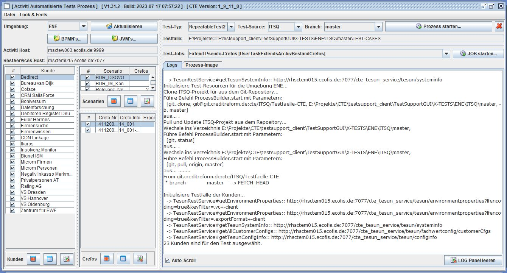
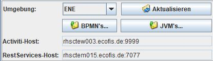
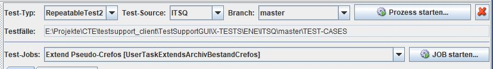
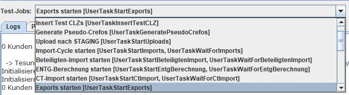
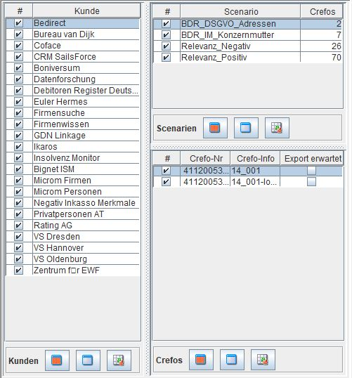
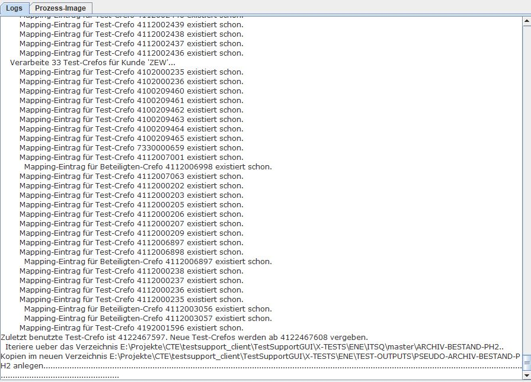
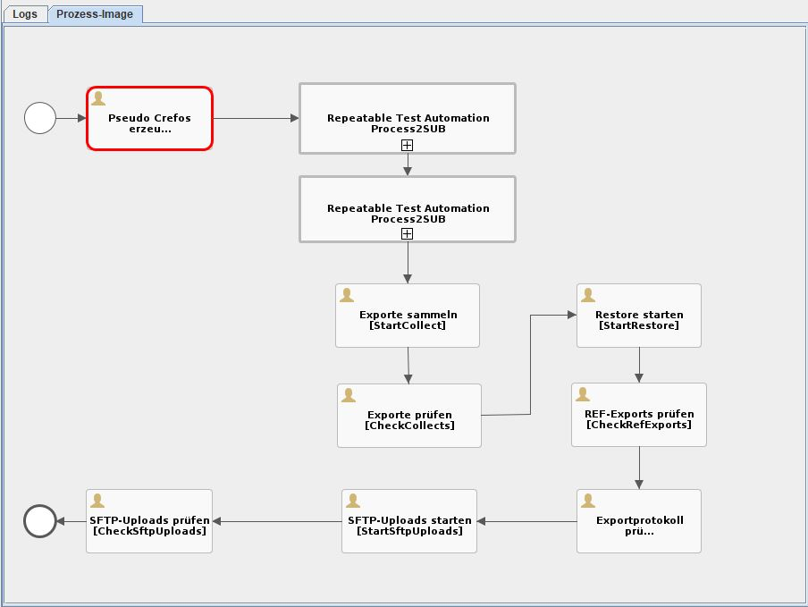
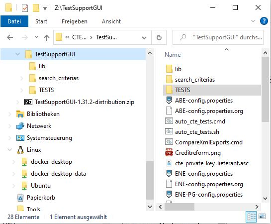
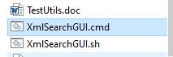

= TestSupport-Tool
Kemal Cavdar <k.cavdar@verband.creditreform.de>
3.0, July 29, 2022: AsciiDoc article template
:toc:
:toc-title: Inhaltsverzeichnis
:icons: font
:url-quickref: https://docs.asciidoctor.org/asciidoc/latest/syntax-quick-reference/

TestSupport-Tool dient dazu, automatisierte Tests für CTE-Kundenexporte zu fahren,

== Das Hauptfenster

Das Hauptfenster ist in mehreren Bereichen aufgeteilt:

* Umgebungen
* Test-Typ und Repository
* Kunden / Test-Scenarien / Testfälle
* Testverlauf / Prozess-Zustand

Im folgenden werden diese Bereiche und deren Bedienung erläutert.

=== Umgebungen

Hier wird aus der ComboBox die zu testene Umgebung ausgewählt. Der Test kann für die Umgebungen *ENE*, *GEE* und *ABE* gestartet werden. Die Umgebung *PRE* ist hier nicht aufgelistet, weil keine Tests in PRE durchgeführt werden können/dürfen.

Derzeit existiert noch eine Umgebung, die als *ENE-PG* aufgelistet ist. Diese Umgebung ist die ENE-Umgebung mit PostgreSQL und nur so lange vorhanden, bis die PostgreSQL-Umstellung komplett ist.

Wird in der ComboBox die gewünschte Umgebung selektiert, so werden werden dann die voreingestellten Kunden sowie deren Testfälle aus der jeweiligen Konfig-Datei bspw. *ENE-config.properties* ausgelesen und die GUI entsprechend initialisiert.
Eine Aktualisierung kann auch manuell durch den so gekennzeichneten Button erfolgen.

Zusätzlich zu der Umgebung-ComboBox werden hier die URL's des ACTIVI-Servers sowie der Masterkonsole als Info ausgegeben.

====
Die Buttons *BPMN's* sowie *JVM's*, sofern sichtbar, sind ^für KC-Interne Zwecke erstellt und können nicht benutzt werden!
====

==== Test-Typ und Repository

In diesem Bereich der GUI können der *Test-Typ*, die *Test-Source*, sowie der *Branch* der ITSQ-Sourcen ausgewählt. Nach Auswahl aller Test-Einstellungen kann der Test duch Betätigen des Buttons *Prozess starten* beginnen.

===== Test-Typ

Es werden derzeit 2 verschiedene Terst-Typen unterstützt.

* RepeatableTest

 Bei diesem Testart wird der Tesprozess "einmal" durchlaufen. Der Prozes besteht aus sogenannten *UserTask* s, die nacheinander ausgeführt werden.

* RepeatableTest2

 Bei diesem Testart wird der Tesprozess "zweimal" durchlaufen. Im Ersten Durchlauf werden die Test-Crefos aus dem Verzeichnis ARCHIV-BESTAND-PH1, im Zweiten Durchlauf aus dem Verzeichnis ARCHIV-BESTAND-PH1 exportiert. Im Anschluss werden die Exporte gesammelt und mirt den Referenzen aus dem Verseichnis REF-EXPORTS verglichen.

===== Test-Source

In dieser ComboBox kann der Source des Test-Pakets ausgewählt werden.

* ITSQ

 Wird diese Auswahl getroffen, werden die Test-Daten aus dem GIT-Repository heruntergeladen und verwendet. In diesem Falle kann dann zusätzlich der GIT-Branch ausgewählt werden. Default ist "master"

* LOCAL

 Wird diese Auswahl getroffen, werden die Test-Daten aus dem lokalen Unterverzeichnis LOCAL im Basis-Verzeichnis geladen.

===== Test-Jobs

Um einen manuellen Test zu starten, ist im Unteren Bereich dieses Teil-Fensters ein ComboBox mit den einzelnen Prozess-Schritten, die sogenannten *UserTask* s untergebracht. Die Reihenfolge entspricht der *UserTask* s aus dem Prozess. Durch auswählen eines *UserTask* s und Betätigen des Buttons *Job starten* kann dieser gestartet werden.

=== Kunden / Test-Scenarien / Testfälle

In diesem Bereich werden die Test-Kunden, deren Test-Scenarien und die Testfälle der einzelnen Test-Scenarien dargestellt.
Jeder Kunde bzw. seine Scenarien können einzeln ausgewählt oder abgewählt werden. Der Test wird dann nur für die selektierten Scenarien des selektierten Kunden durchgeführt.

=== Testverlauf / Prozess-Zustand

In diesem Bereich wird der Verlauf des Testprozesses angezeigt. Im Ersten Tab sind die LOG-Ausgaben, im Zweiten die graphische Darstellung des Prozesses angezeigt.

== Konfiguration

=== App-Konfigurationsdatei
Beim Start des Programms wird zuerst die App-Propertis-Datei *TestSupportGUI.properties* eingelesen, in der die Voreinstellungen des Programms, wie Fensterposition, letzte ComboBox-Auswal für Umgebung, Test-Typ etc. stehen.

 #
 #Tue Jul 25 11:11:42 CEST 2023
 A.selectedEnvironment=ENE
 ABE.ItsqRevision=master
 ABE.SelectedTestType=TEST_TYPE_PHASE2_ONLY
 ABE.TestSesSource=LOCAL
 ENE-PG.ItsqRevision=master
 ENE-PG.SelectedTestType=TEST_TYPE_PHASE2_ONLY
 ENE-PG.TestSesSource=ITSQ
 ENE-PG.height=898
 ENE-PG.lookandfeel=Nimbus
 ENE-PG.width=1671
 ENE-PG.xpos=-1807
 ENE-PG.ypos=80
 ENE.ItsqRevision=master
 ENE.SelectedTestType=PHASE1_AND_PHASE2
 ENE.TestSesSource=ITSQ
 ENE.height=721
 ENE.lastloadpath=E\:\\Projekte\\CTE\\testsupport_client\\TestSupportGUI
 ENE.lookandfeel=Nimbus
 ENE.width=1341
 ENE.xpos=-1731
 ENE.ypos=84
 GEE.SelectedTestType=PHASE1_AND_PHASE2
 GEE.TestSesSource=LOCAL

=== Test-Prozess Konfigurationsdatei
Die Konfiguration des Test-Prozesses wird aus der Umgebungskonfig-Datei eingelesen.

*ENE-config.properties*

 TEST-BASE-PATH                   = /TESTS
 TEST-TYPES                       = PHASE1_AND_PHASE2
 TEST-SOURCES                     = ITSQ
 MAX_CUSTOMERS_PER_TEST           = 8
 ADMIN_FUNCS_ENABLED              = true
REPOSITORY_HOST                  = git@git.creditreform.de:cte
 REPOSITORY_USER                  = tesuntestene
 REPOSITORY_PASSWORD              = tesuntestene
 GIT_REPO_ITSQ_TEST_FAELLE        = /ITSQ/Testfaelle-CTE

 BEA-URI                          = http://rhsctem015.ecofis.de:7077
 BEA-TESUN-USERNAME               = tesuntestene
 BEA-TESUN-PASSWORD               = tesuntestene

 JVM_IMPCYCLE-URI                 = http://rhsctem015.ecofis.de:7051
 JVM_IMPCYCLE-USERNAME            = tesuntestene
 JVM_IMPCYCLE-PASSWORD            = tesuntestene

 JVM_INSO-URI                     = http://rhsctem016.ecofis.de:7079
 JVM_INSO-USERNAME                = tesuntestene
 JVM_INSO-PASSWORD                = tesuntestene

 CTE_BATCH_GUI_URL                = http://rhsctem015.ecofis.de:7071

 ACTIVITI-URI                     = http://rhsctew003.ecofis.de:9999/
 ACTIVITI-USERNAME                = CAVDARK-ENE
 ACTIVITI-PASSWORD                = cavdark

 AVAILABLE_CUSTOMERS              = bdr,bvd,cef,ctc,drd,dfo,fw,gdl,ika,ism,rtn,vsd,vsh,vso,zew,nim,fsu,mic,mip,eh,crm,inso_kundenplz,inso_test-tool,ppa,foo,sdf

== Test-Umgebung

Das Test-Tool wird als ZIP-Datei mit dem Namens-Pattern *TestSupportGUI-x.y.z-distribution.zip* gebaut und muss entpackt werden. Nach dem Entpacken sollte die Verzeichnis-Struktur wie folgt aussehen:

Das Tool wird mit Hilfe eines CMD-Programms gestartet:

Das Start-Script sieht wie folgt aus:

 @@ECHO OFF
 SET restInvoker.traceInvokers=false
 REM SET DEBUG_OPTS=-agentlib:jdwp=transport=dt_socket,server=y,suspend=y,address=5005
 SET DEBUG_OPTS=
 SET JVM_ARGS=-Dfile.encoding=UTF8 -Xms1024m -Xmx1280m -XX:+HeapDumpOnOutOfMemoryError -classpath .;lib/*
 SET AUFRUF=@start javaw -splash:Creditreform.png %DEBUG_OPTS% %JVM_ARGS% de.creditreform.crefoteam.cte.tesun.gui.TestSupportGUI %1 %2
 ECHO %AUFRUF%
 %AUFRUF%
 GOTO ENDE
 :ENDE

